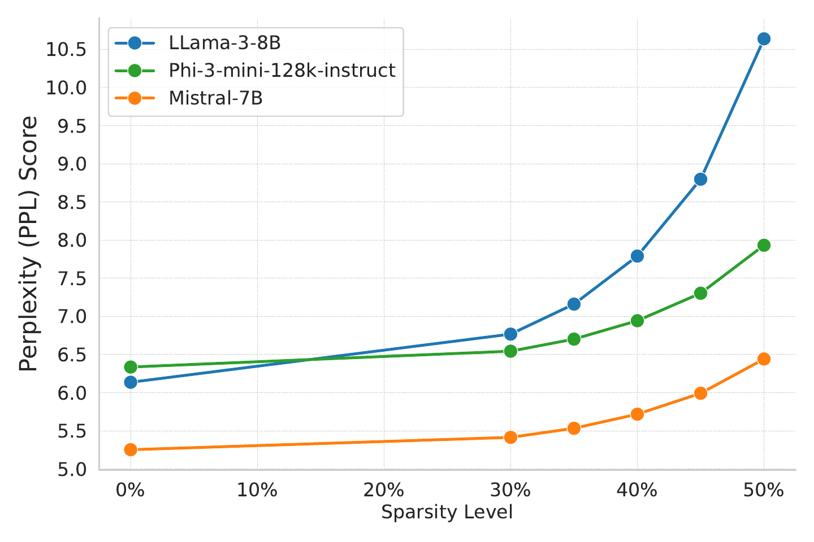
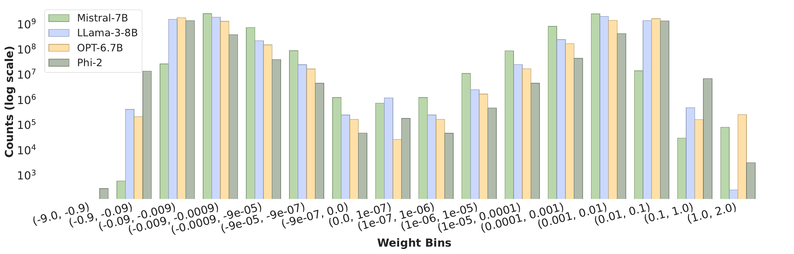
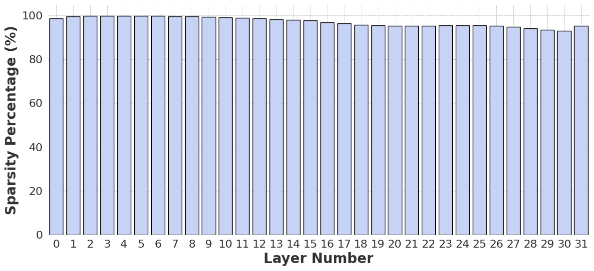
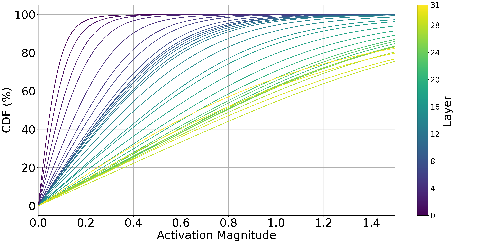
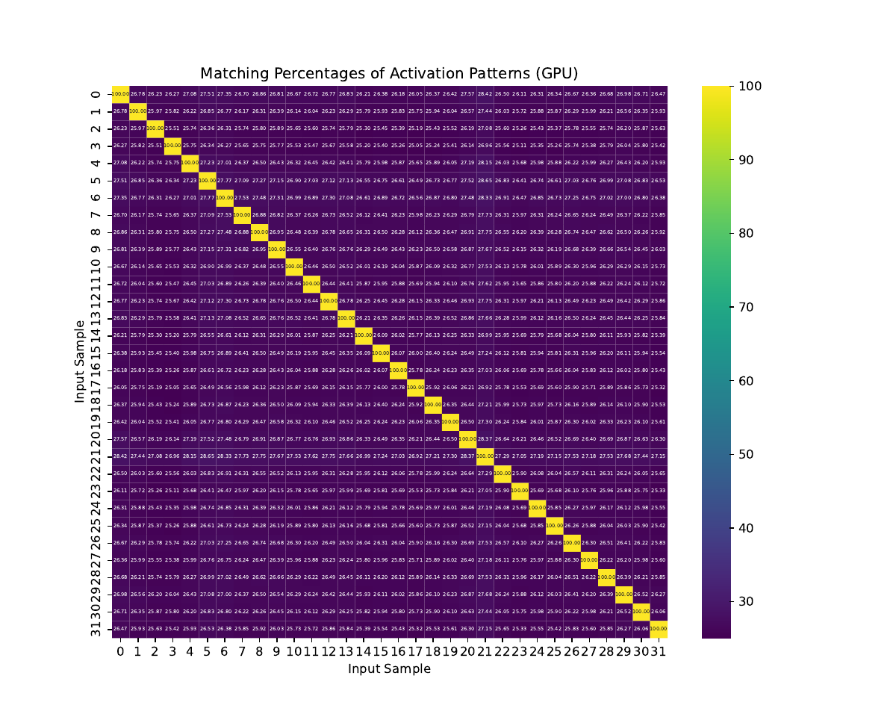

# Activation Sparsity Opportunities for Compressing General Large Language Models

[](https://doi.org/10.1109/IPCCC59868.2024.10850382)
[](https://doi.org/10.1109/IPCCC59868.2024.10850382)
[](LICENSE)

Research code and calibrated artifacts for our IEEE IPCCC 2024 paper on
injecting activation sparsity into pre-trained LLMs — a foundation for
predict-and-prefetch inference on memory-constrained devices.

**Highlights**

- **First systematic study of *enforcing* activation sparsity in
  state-of-the-art LLMs** (per the paper's contribution statement): modern
  models abandoned ReLU and with it lost the natural sparsity that prior
  compression work depends on — we show ~50% sparsity can be **created** in
  these sparsity-less models (Llama-3-8B, Mistral-7B, Phi-3), with no
  retraining, no weight changes, and zero loss up to 30%.
- **Why it matters:** FFN layers hold ~2/3 of LLM parameters; skipping inactive
  neurons means their weights never need to be fetched from storage — the key
  to running models that exceed device memory. The approach is **orthogonal to
  pruning, quantization, and distillation** — it stacks on top of them.
- **Everything ships in this repo:** evaluation code, calibrated thresholds for
  five sparsity levels × three models, the perturbation-experiment inputs, the
  published figures, and the paper — all
  [re-verified end-to-end before release](#independent-re-verification-august-2026).

**Contents:**
[Contribution](#contribution-at-a-glance) ·
[The research story](#the-research-story-six-figures) ·
[What's inside](#whats-inside) ·
[Reproduce it](#reproduce-it-yourself) ·
[Re-verification](#independent-re-verification-august-2026) ·
[Citation](#citation) ·
[License](#license--acknowledgments)

## The paper

> **Nobel Dhar**, Bobin Deng, Md Romyull Islam, Kazi Fahim Ahmad Nasif, Liang
> Zhao, Kun Suo. *Activation Sparsity Opportunities for Compressing General
> Large Language Models.* IEEE International Performance, Computing, and
> Communications Conference (IPCCC 2024). DOI:
> [10.1109/IPCCC59868.2024.10850382](https://doi.org/10.1109/IPCCC59868.2024.10850382)
> — [PDF in this repo](paper/IPCCC2024_Activation_Sparsity.pdf)

## Contribution at a glance

**The problem:** activation-sparsity compression (e.g. Apple's LLM-in-a-flash,
DejaVu) relies on ReLU zeroing most neurons for free. State-of-the-art LLMs
switched to SwiGLU — and their natural sparsity vanished. The evolution of
activation functions silently broke an entire compression avenue.

**What this paper contributes:**

1. **Found the room where sparsity can be created.** Systematic analysis of
   weight and activation distributions shows today's LLMs offer no natural
   sparsity to exploit — but their FFN activation magnitudes concentrate
   overwhelmingly near zero. That concentration is itself a finding: ~50% of
   FFN activation values can be safely withdrawn.
2. **First systematic enforcement of activation sparsity in modern LLMs.**
   Per-layer magnitude thresholds *create* sparsity where none existed —
   on pre-trained models as-is, with no retraining or fine-tuning:

| Model (SwiGLU) | Natural sparsity | **Sparsity enabled** | PPL 0% → 50% (Fig. 8) |
|---|---|---|---|
| Llama-3-8B | none | **0% → 50%** | ~6.2 → ~10.6 (loss-free through 30%) |
| Mistral-7B | none | **0% → 50%** | ~5.3 → ~6.5 (loss-free through 30%) |
| Phi-3-3.8B | none | **0% → 50%** | ~6.5 → ~8.0 (loss-free through 30%) |

*(Contrast: ReLU-era OPT-6.7B gets ≥92.8% sparsity for free and NewGELU Phi-2
under 6% — but no state-of-the-art LLM uses ReLU anymore, which is precisely
the gap this work fills.)*



3. **Showed the created sparsity is convertible into compression.** The
   enforced activation patterns are highly predictable — 9 of 12 test inputs
   keep a **100% layer-1 pattern match even with 30% of their tokens
   replaced** (Table II) — so a predictor can prefetch only the ~50% of FFN
   weights that will activate: less disk wait, higher memory hit rate, less
   compute, an extra ~50% compression from the memory system's perspective.

## The research story (six figures)

The paper is a process of elimination — each experiment closes one door until
enforced activation sparsity is the only one left open. Each step maps onto a
stage of this repository's pipeline.

**1. The FFN is the bottleneck.** FFN/MLP layers (gate/up/down projections)
hold about 2/3 of all parameters. Attention is deliberately left untouched —
modifying it is far more likely to hurt accuracy.

**2. Weight sparsity is a dead end.** Weight magnitudes cluster near zero, but
almost none are *exactly* zero — no exploitable natural weight sparsity in any
of the four models examined (*"we must explore another sparsity type:
activation sparsity"*):



**3. Natural activation sparsity is a ReLU-only privilege.** ReLU zeroes every
negative input, so OPT-6.7B gets ≥92.8% sparsity for free — but modern LLMs
abandoned ReLU. Phi-2 (NewGELU) shows under 6%; SwiGLU models show none:



**4. But the magnitudes reveal the room.** Collecting the FFN activations
(→ [stage 1](#stages-1-2-recalibrate-from-scratch)) and plotting their CDFs
shows that SwiGLU activations **concentrate in tiny magnitude ranges** — ~80%
of Mistral-7B's early-layer gate activations fall below 0.1–0.25, contributing
almost nothing to the output. That concentration *is* the room: a small
per-layer threshold zeroes huge fractions of neurons at minimal cost:



**5. Price the trade-off.** Calibrate percentile thresholds per sparsity level
(→ stage ②), enforce `x = where(|x| >= T, x, 0)` on the gate/up/down outputs,
and measure WikiText-2 perplexity (→ stage ③). Result: **30% sparsity is
essentially free; 50% keeps PPL acceptable** (see
[Contribution at a glance](#contribution-at-a-glance)).

**6. Patterns are predictable — sparsity becomes compression.** Which neurons
survive is stable across similar inputs (9/12 samples: 100% layer-1 match at
30% token replacement; inputs shipped in
[`perturbation_samples/`](perturbation_samples/)):



A cheap early-layer predictor can therefore prefetch only the ~50% of FFN
weights that will activate — *"compress 50% of LLMs from the system resources'
perspective."* Our follow-up work picks up exactly this thread
(Euro-Par 2025, [arXiv:2507.14179](https://arxiv.org/abs/2507.14179)).

## What's inside

| Path | What it is |
|---|---|
| [`awq/entry_new.py`](awq/entry_new.py) | **The paper's evaluation script**: wraps each MLP with a thresholding class (`ThresholdLlamaMLP` for SwiGLU models, `ThresholdPhi3MLP` for Phi-3's fused gate_up), collects activation samples to HDF5 (`--collect-activations`), runs WikiText-2 perplexity under enforced sparsity |
| [`threshold_determination.py`](threshold_determination.py) | Percentile threshold calibration from HDF5 activation samples ([GPU variant](threshold_determination_gpu.py); [Phi-3 variant](phi-3_threshold_determination.py)) |
| `LLama-3-8B_activation_sample/`, `Mistral-7B-Activation_samples/`, `Phi-3_activation_samples/` | **Calibrated per-layer thresholds at 30/35/40/45/50% sparsity** — the exact JSONs behind the paper's Fig. 8 sweep (directory names preserved so the scripts' relative paths work; the multi-hundred-GB raw HDF5 samples are not distributed — regenerate via stage ①) |
| [`perturbation_samples/`](perturbation_samples/) | The 12 input samples of Table II's predictability experiment, each with its 6 perturbed variants (95–70% similarity) |
| [`results/`](results/) | Fig. 2 weight-histogram data, pattern-match heatmaps, and the [2026 reproduction outputs](results/reproduction_2026/) |
| [`paper_figures/`](paper_figures/), [`paper/`](paper/) | Published figures and the paper PDF (© IEEE) |

Base code: official [mit-han-lab/llm-awq](https://github.com/mit-han-lab/llm-awq)
at commit `7901983` (our experiment scaffolding; original README preserved as
[AWQ_README.md](AWQ_README.md); the unrelated TinyChat demo is omitted, and
[`awq/quantize/pre_quant.py`](awq/quantize/pre_quant.py) gains
Phi-2/Phi-3/Mistral/Qwen2/Gemma2 support).

> Release note: the 2024 research scripts are shipped faithfully, with minimal
> fixes for public use (threshold-JSON key lookup, optional-import guards, a
> CLI for the calibration script, a `--collect-activations` flag wiring up the
> previously script-internal collection stage, float32 percentile
> computation). The measurement logic — activation capture, thresholding math,
> perplexity loop — is unchanged.

## Reproduce it yourself

```bash
# Environment (Python >= 3.10)
conda create -n sparsity python=3.10 -y && conda activate sparsity
pip install -e .        # installs the awq package + all evaluation deps
```

### Stage 3: evaluate with the shipped thresholds (quick start)

```bash
# Llama-3-8B at 50% enforced FFN sparsity on WikiText-2.
# Run from the repo root (threshold JSONs are loaded by relative path);
# --model_path takes a local model directory or a Hugging Face Hub id.
python -m awq.entry_new --model_path meta-llama/Meta-Llama-3-8B \
    --tasks wikitext --output_path ./ppl_llama3_50.json
# Swap --thresholds to sweep other sparsity levels or models, e.g.
#   --thresholds ./Mistral-7B-Activation_samples/thresholds_30_percent_sparsity.json
```

### Stages 1-2: recalibrate from scratch

```bash
# Stage 1 - collect absolute FFN activations from the unmodified model (HDF5)
python -m awq.entry_new --model_path <model> \
    --collect-activations calib_samples --collect-windows 4

# Stage 2 - percentile thresholds at the target sparsity level
python threshold_determination.py --input-dir calib_samples --sparsity 0.50
```

Hardware: the paper's experiments ran on a Lambda server with four NVIDIA RTX
2080 Ti GPUs (models shard across GPUs via `accelerate`); a single 24 GB GPU
suffices for the 7–8B models in fp16.

## Independent re-verification (August 2026)

I release research artifacts only after re-running them: before publishing
this repository, the shipped code and thresholds were re-verified end-to-end
on an A100 server
(raw outputs in [`results/reproduction_2026/`](results/reproduction_2026/)).

**Evaluation with the shipped 2024 thresholds** reproduces the paper's Fig. 8
within reading precision:

| Model | Enforced sparsity | Reproduced WikiText-2 PPL | Paper (Fig. 8) |
|---|---|---|---|
| Mistral-7B | 30% | **5.418** | ≈ baseline (~5.3–5.5) |
| Mistral-7B | 50% | **6.448** | ~6.5 |
| Llama-3-8B | 50% | **10.675** | ~10.6 (stated "< 11") |

**Full-pipeline reproduction** — all three stages rerun from scratch for
Mistral-7B at 50%: activations freshly collected (4 WikiText-2 windows),
thresholds recalibrated, then evaluated. The regenerated thresholds agree with
the shipped May-2024 calibration to **1.6% mean / 4.5% max relative difference
across all 96 layer-thresholds**
([JSON](results/reproduction_2026/regenerated_thresholds_50.json)), yielding
**PPL 6.439** vs 6.448 with the shipped thresholds — the collect → calibrate →
evaluate story reproduces from this repository alone.

## Citation

```bibtex
@inproceedings{dhar2024activation,
  author    = {Dhar, Nobel and Deng, Bobin and Islam, Md Romyull and
               Nasif, Kazi Fahim Ahmad and Zhao, Liang and Suo, Kun},
  title     = {Activation Sparsity Opportunities for Compressing General Large
               Language Models},
  booktitle = {IEEE International Performance, Computing, and Communications
               Conference (IPCCC 2024)},
  year      = {2024},
  publisher = {IEEE},
  doi       = {10.1109/IPCCC59868.2024.10850382}
}
```

Machine-readable citation: [`CITATION.cff`](CITATION.cff). Follow-up work:
activation-pattern clustering for sparsity prediction — Euro-Par 2025, Springer
LNCS 15900, [arXiv:2507.14179](https://arxiv.org/abs/2507.14179).

## License & acknowledgments

MIT — this repository inherits the [MIT license](LICENSE) of
[llm-awq](https://github.com/mit-han-lab/llm-awq) (© 2023 MIT HAN Lab) for the
base code; our additions are © 2024–2026 the paper's authors, same license.
The paper PDF is © IEEE; the Version of Record is at the DOI above.

Research supported in part by U.S. National Science Foundation grants,
conducted at Kennesaw State University.

**Contact:** Nobel Dhar —
[Google Scholar](https://scholar.google.com/citations?user=OA35VhMAAAAJ) ·
[GitHub](https://github.com/nobeldhar) · nobeldhar807@gmail.com
